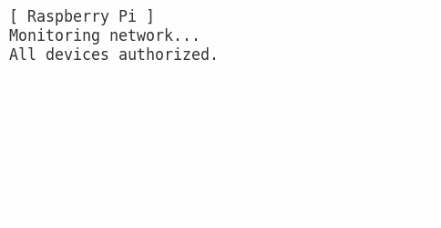

# Network IDS – Raspberry Pi + Arduino Enterprise-Grade Intrusion Detection System

A real-time, lightweight intrusion detection system built for cybersecurity education and lab defense.  
Combines **Snort** for deep packet inspection and **Arduino** for physical alerts — perfect for Security+, OSCP prep, or DIY SOC projects.

---

## Key Features

- **Snort-powered** network monitoring (L3/L4 packet inspection)
- **Python-based log monitor** with threat classification via `sigmap.json`
- **SIEM-ready logs** (`.log` + `.csv`)
- **Arduino alert hardware** (LED/buzzer with unique tones)
- **Systemd support** (runs on boot)
- **Well-documented** setup and architecture

---

## Documentation

- [System Architecture](Docs/architecture.md)
- [Deployment Guide](Docs/deployment.md)
- 
- 

---

## Use Cases

- Cybersecurity certification labs (Security+, OSCP, CEH)
- Raspberry Pi hacking/defense projects
- CTF home setups
- Physical SOC simulations (alerts you can see and hear)
- Teaching threat response in classrooms or workshops

---

## Setup

### 1. Install Dependencies

```bash
sudo apt update
sudo apt install snort python3-pip nmap
pip3 install pyserial
```

### 2. Configure Snort Rules

Add to `/etc/snort/rules/local.rules`:

```snort
alert tcp any any -> any 80 (msg:"Nmap Scan Detected"; flags:S; sid:1000001; rev:1;)
alert tcp any any -> any 443 (msg:"Exploit Attempt"; sid:1000002; rev:1;)
```

### 3. Upload Arduino Code

Upload `arduino/alert_system.ino` using Arduino IDE.  
Wire LED to pin 8 and buzzer to pin 9.

### 4. Enable Auto-Start

```bash
sudo cp system/network-ids.service /etc/systemd/system/
sudo systemctl daemon-reexec
sudo systemctl enable network-ids
sudo systemctl start network-ids
```

---

## Alert Types

| Type         | SID        | Arduino Reaction         |
|--------------|------------|--------------------------|
| UNAUTHORIZED | N/A        | 1kHz tone (2 sec)        |
| SCAN         | 1000001    | 2kHz sustained tone      |
| EXPLOIT      | 1000002    | 3 rapid 3kHz pulses      |

---

## Directory Structure

```
network-ids-enterprise/
├── arduino/         # alert_system.ino
├── pi/              # monitor.py, sigmap.json
├── Docs/            # architecture.md, deployment.md, diagrams
├── logs/            # Sample output
├── system/          # systemd service
├── LICENSE
├── README.md
└── requirements.txt
```

---

## License

This project is licensed under the MIT License.  
See [LICENSE](LICENSE) for details.
